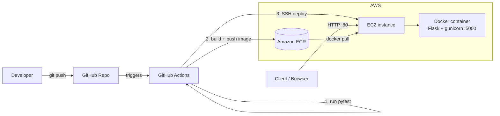

# Cloud Microservice on AWS (Docker + ECR + EC2 + GitHub Actions)

A small Flask microservice that is containerised with Docker, stored in **Amazon ECR**, and deployed on an **Amazon EC2** instance. **GitHub Actions** tests every change and automatically deploys when tests pass.

## What I built
- A REST API (Python / Flask) with endpoints for health checks, greeting, addition and host info.
- A Docker image served by gunicorn.
- A CI/CD pipeline: test → build image → push to ECR → deploy to EC2.
- 6 automated tests; merging to `main` is blocked if they fail (branch protection).

## Architecture



Request path: **Client → EC2 (port 80) → Docker container (port 5000)**

## API endpoints
| Endpoint | Description |
|---|---|
| `GET /` | Welcome message and version |
| `GET /health` | Health check, returns `{"status":"ok"}` |
| `GET /hello/<name>` | Greets the given name |
| `GET /add/<a>/<b>` | Adds two integers |
| `GET /info` | Hostname of the serving container and UTC time |

## Project structure
```
app/main.py                  Flask application
tests/test_app.py            6 pytest test cases
Dockerfile                   Container image definition
.github/workflows/ci-cd.yml  CI/CD pipeline
docs/AWS_SETUP.md            One-time AWS setup guide
```

## How to run

### Locally (Python)
```bash
python -m venv .venv
source .venv/bin/activate        # Windows: .venv\Scripts\activate
pip install -r requirements-dev.txt
python -m app.main               # http://localhost:5000
```

### Run the tests
```bash
pytest -v
```

### Locally with Docker
```bash
docker build -t cloud-microservice .
docker run -p 5000:5000 cloud-microservice
# open http://localhost:5000/health
```

### Deploy to AWS
Follow [docs/AWS_SETUP.md](docs/AWS_SETUP.md) once. After that, every push to `main` runs the tests and, if they pass, deploys automatically.

Live URL: `http://<EC2-PUBLIC-IP>/` &nbsp;(replace with your instance's IP)

## CI/CD flow
1. **Pull request / push** → `test` job runs `pytest`.
2. Branch protection blocks the merge if `test` fails.
3. On push to `main` and passing tests → `deploy` job builds the image, pushes it to ECR, then SSHes into EC2 to pull and restart the container.

## Concepts demonstrated
Containers (Docker), cloud deployment (EC2), container registry (ECR), IAM roles and least privilege, client-server communication over HTTP, CI/CD automation.
